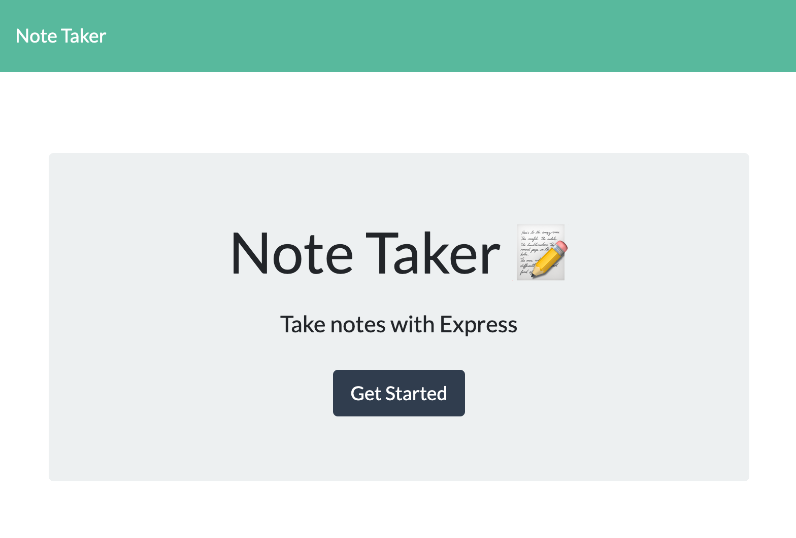
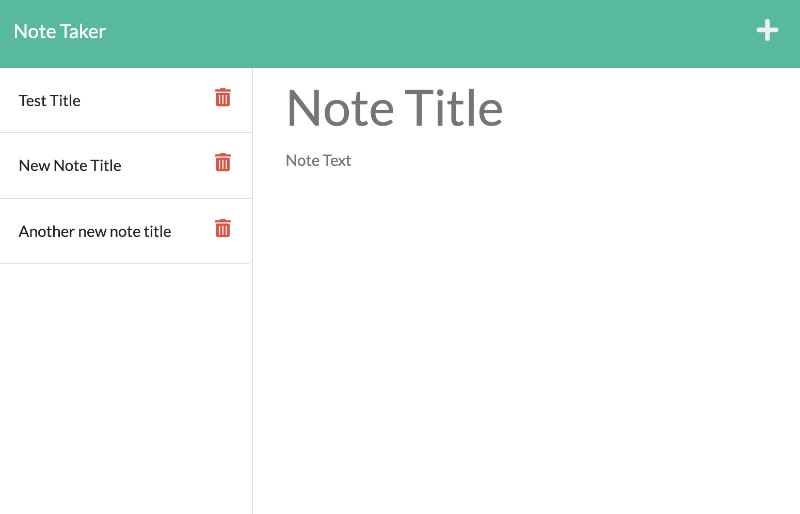

# Note Taker 3000
## Description:
This is a note taking app allowing users to create a list of things they need to remember or do. 

## Demo: 

Link to demo video:
https://watch.screencastify.com/v/Km43wHaXINvz4E3Ni2cd
## Table of Contents:

- [Installation](#installation)
- [Usage](#usage)
- [Contributions](#contributions)
- [Tests](#tests)
- [License](#license)
- [Questions](#questions)

## Installation:

## Usage
Click link on landing page, click plus sign in upper right corner, type notes, click save icon. 
## Contributions

## Tests

## License

None
## Questions
*If you have any questions, please reach out to me via email and take a look at my GitHub.*
GitHub: <a href="https://github.com/JasonVissage">Github.com/JasonVissage</a>
Email: <a href="mailto:JasonVissage@yahoo.com">JasonVissage@yahoo.com</a>
